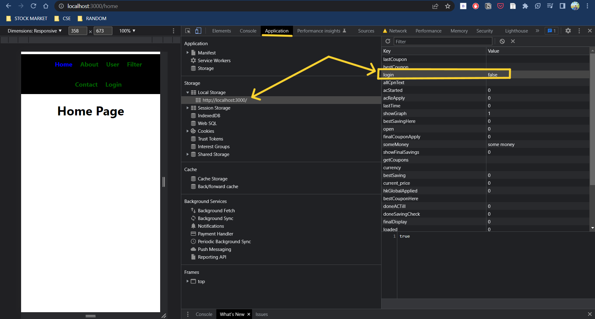
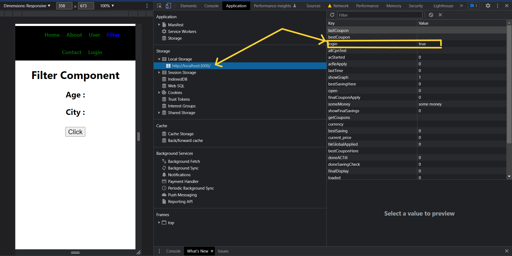

NOTES:

## searchParams

It can be useful ass it searches the params and get the data. It can be seen in Filter component as it gets and sets data from the link given from the about component.

By clicking it can be set to desired value and also changes the URL as well.

## Before Click

## After Click

