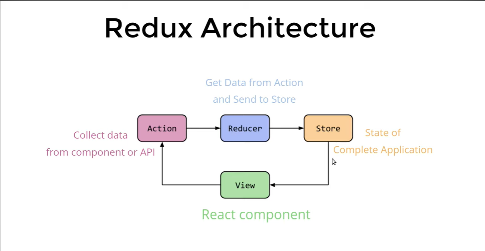

NOTES:

## Redux

* React is a state management tool.
* It dosen't belong to the component state.
* It stores the data not as database but for session only. When its refreashed the data vanishes.
* One application will have only one store.

## Redux Architecture

## File and Folder Structure

1. Components --> Header,Footer,Sidebar,etc.
2. Container  --> Connect the Components to Redux.
3. Service    --> We will keep all the Redux here.
              --> { Actions, Reducers & Constants }